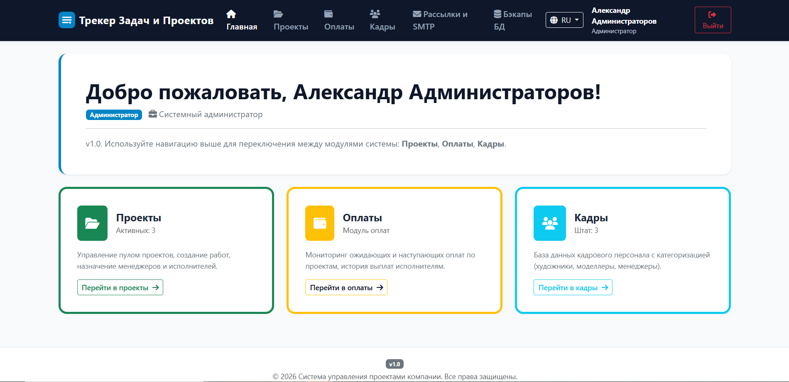
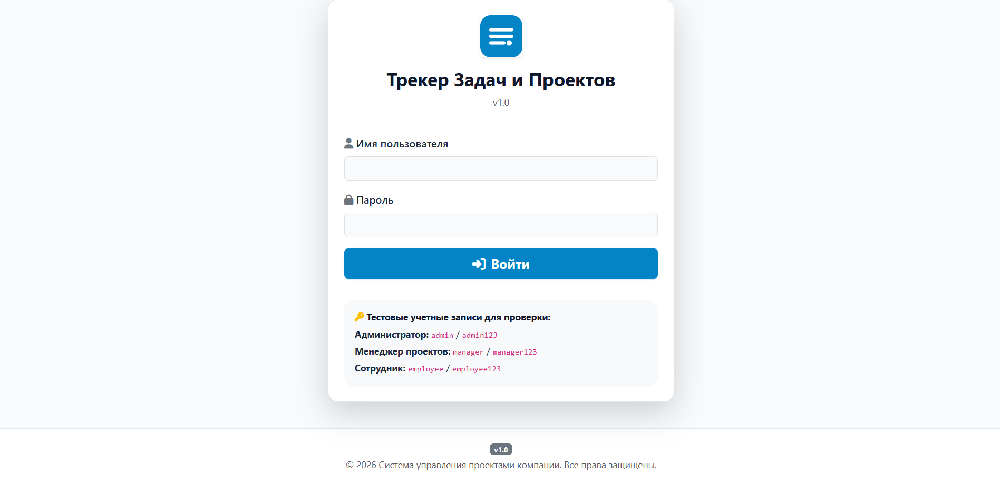
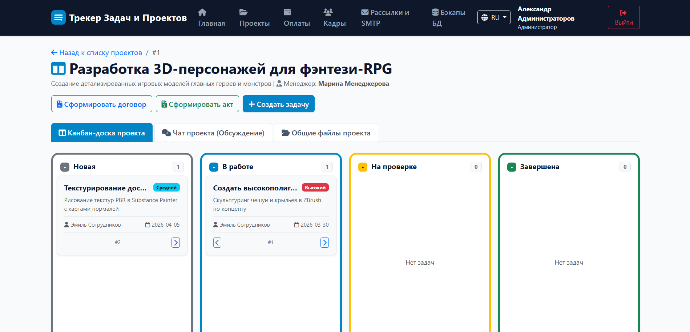
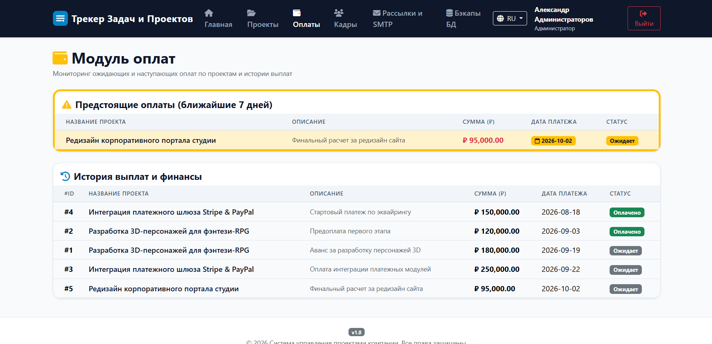
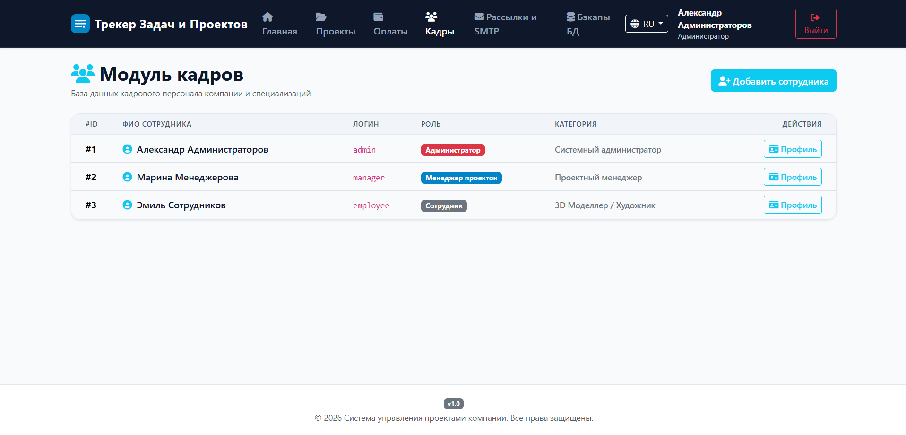
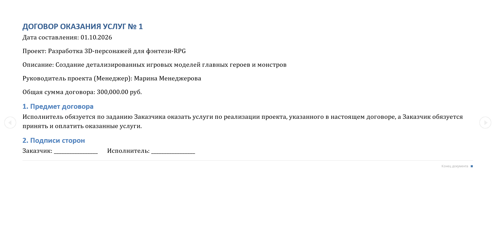

# Project Tracker — корпоративный трекер задач для 3D-студии

SaaS-система управления проектами: пул проектов и работ с канбан-доской, мониторинг оплат с подсветкой ближайших 7 дней, база кадров с ролями, автобэкапы БД, генерация договоров и актов, RU/EN.

**🌐 Живое демо:** https://project-tracker-production-0a3a.up.railway.app
**🔑 Тестовые входы:** admin / admin123 · manager / manager123 · employee / employee123

## Скриншоты








---# Apex Project & Task Tracker

Современная веб-система управления проектами, задачами, финансами и кадровым персоналом для IT-компаний и студий разработки.

## Основной функционал

1. **Авторизация и роли (RBAC):**
   - **Администратор (`admin`):** полный доступ ко всем модулям системы и управлению персоналом.
   - **Менеджер проектов (`manager`):** управление проектами, канбан-доской задач, финансами и просмотр штата.
   - **Сотрудник (`employee`):** доступ к проектам и своим задачам.

2. **Модуль «Проекты» (Канбан-доска):**
   - Проекты и пулы работ.
   - Канбан-доска по статусам: *Новая*, *В работе*, *На проверке*, *Завершена*.
   - Карточки задач с приоритетами (*Низкий*, *Средний*, *Высокий*), сроками, исполнителями, комментариями и прикреплением файлов.

3. **Модуль «Оплаты»:**
   - Таблица оплат по проектам (сумма, дата, статус *Ожидает* / *Оплачено*).
   - Интеллектуальная подсветка предстоящих оплат (в ближайшие 7 дней).
   - История выплат и финансовый учет.

4. **Модуль «Кадры»:**
   - База данных сотрудников с категоризацией (художники, моделлеры, менеджеры).
   - Страница детализации сотрудника (проекты и назначенные задачи).
   - Добавление новых сотрудников администратором.

5. **Двуязычный интерфейс:**
   - Переключение между **русским** и **английским** языком интерфейса в один клик.

---

## Локальный запуск (для разработчиков)

1. Установите **Python 3.10+**.
2. Установите зависимости:
   ```bash
   pip install -r requirements.txt
   ```
3. Запустите приложение:
   ```bash
   python app.py
   ```
4. Откройте в браузере: **`http://localhost:5000`**

### Тестовые учетные записи:
- **Администратор:** `admin` / `admin123`
- **Менеджер:** `manager` / `manager123`
- **Сотрудник:** `employee` / `employee123`
